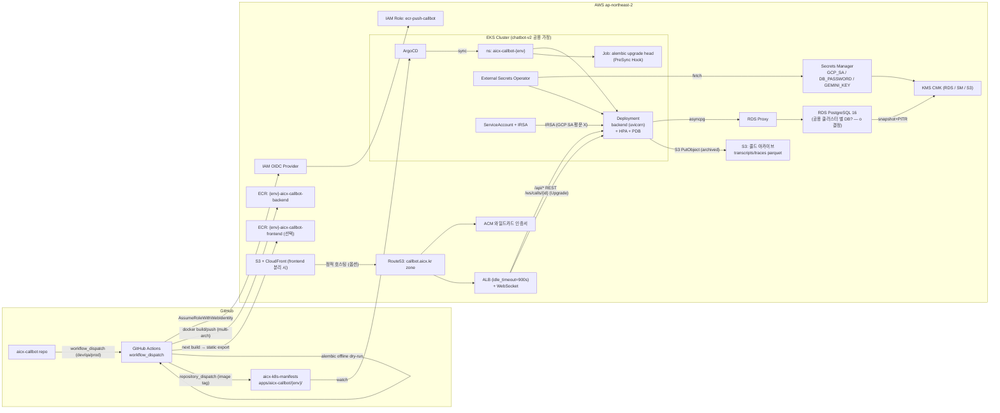

# aicx-callbot 배포 인프라 & 데이터베이스 설계

- 작성일: 2026-05-12
- 단계: **설계만**. 코드/매니페스트/SQL/migration 일체 생성 금지. 사용자 승인 후 별도 PR 에서 구현.
- 레퍼런스: `/Users/dongwanhong/Desktop/TEST/chatbot-v2` (이하 "chatbot-v2")
- 대상: `/Users/dongwanhong/Desktop/chat-STT-TTS/aicx-callbot` (이하 "callbot")
- 리전: ap-northeast-2 고정
- 도메인 루트: aicx.kr

---

## a. 현재 상태 진단

### a-1. callbot 부재 항목 (이번 PR 의 빈칸)
| 영역 | 현재 상태 | 비고 |
|---|---|---|
| Dockerfile (backend) | 없음 | `run.sh` 로 venv + uvicorn 로컬 부팅만 |
| Dockerfile (frontend) | 없음 | Next.js 15, App Router, 빌드 산출물 분리 안 됨 |
| `.github/workflows` | **없음** (callbot 루트에는 `.github` 자체 부재) | CI/CD 미구성 |
| k8s manifests | 없음 | manifests 레포에 callbot 영역 신설 필요 |
| IaC (Terraform 등) | 없음 | AWS 리소스 수동/콘솔 추정 |
| 운영 DB | SQLite (`backend/callbot.db`, ~3MB, `callbot-share.db` 도 존재) | 단일 파일, 동시쓰기 약함, async 불가 |
| 마이그레이션 도구 | **없음** — `src/app.py::_migrate_sqlite_add_columns()` 가 ad-hoc ALTER로 누락 컬럼 7개 추가 | 운영 부적합 |
| 모델 분할 | 단일 `infrastructure/models.py` (276 LOC, 13 모델) | chatbot-v2 는 모델당 1 파일 |
| 시크릿 관리 | `.env` 파일 평문 | Secrets Manager 미사용 |
| 관측성 | stdout 로깅(`core/logging.py`) — 외부 수집기 미연결 | LangSmith 미통합 |
| TLS/도메인 | 로컬 only (8765 직결) | ACM/Route53 미구성 |
| HPA/PDB | 없음 | 멀티 파드 운영 가정 부재 |
| Backup/PITR | SQLite 파일 한 개 | 운영 부적합 |
| WebSocket 인프라 검토 | `/ws/calls/{session_id}` 단일 엔드포인트 (`src/api/ws/voice.py`) | ALB/NLB 결정 미정 |
| 프런트 정적 배포 | `next dev` 로 3000 포트, `BACKEND_URL` rewrite 의존 | 정적 호스팅 분리 vs 동일 이미지 결정 미정 |
| Seed | `seed_if_empty()` + `_backfill_callbot_agents()` 가 lifespan 안에서 자동 실행 | 운영 자동 실행 위험 |
| CORS | `allow_origins=["*"]` | 운영 부적합 |

### a-2. 현 SQLite 스키마 요약 (13 모델, `backend/src/infrastructure/models.py`)
| 테이블 | 핵심 컬럼 | 멀티테넌트 | 외래키 | JSON 컬럼 |
|---|---|---|---|---|
| `tenants` | id, name, slug, created_at | 루트 | - | - |
| `callbot_agents` | id, tenant_id, name, voice, greeting, language, llm_model, pronunciation_dict, dtmf_map, global_rules | ○ tenant_id | tenants.id | pronunciation_dict, dtmf_map, global_rules |
| `callbot_memberships` | id, callbot_id, bot_id, role(main/sub), order, branch_trigger, voice_override | △ (callbot 경유) | callbot_agents.id, bots.id | - |
| `bots` | id, tenant_id, name, persona, system_prompt, greeting, language, voice, llm_model, is_active, agent_type, graph, env_vars, branches, voice_rules, external_kb_enabled, external_kb_inquiry_types | ○ | tenants.id | graph, env_vars, branches, external_kb_inquiry_types |
| `skills` | id, bot_id, name, description, kind(prompt/flow), content, graph, is_frontdoor, order, allowed_tool_names | △ (bot 경유) | bots.id | graph, allowed_tool_names |
| `knowledge` | id, bot_id, title, content | △ | bots.id | - |
| `mcp_servers` | id, bot_id, name, base_url, mcp_tenant_id, auth_header, is_enabled, discovered_tools, last_discovered_at, last_error | △ | bots.id | discovered_tools |
| `tools` | id, bot_id, name, type, description, code, parameters, settings, is_enabled, auto_call_on | △ | bots.id | parameters, settings |
| `call_sessions` | id, bot_id, room_id(unique), status, started_at, ended_at, end_reason, summary, extracted, analysis_status, dynamic_vars | △ | bots.id | extracted, dynamic_vars |
| `transcripts` | id, session_id, role, text, is_final, created_at | △ | call_sessions.id | - |
| `tool_invocations` | id, session_id, tool_name, args, result, error, duration_ms, created_at | △ | call_sessions.id | args |
| `traces` | id, session_id, parent_id(self FK), name, kind, t_start_ms, duration_ms, input_json, output_text, meta_json, error_text | △ | call_sessions.id, traces.id | input_json, meta_json |
| (Tenant 와 동일 — `Tenant` 와 `tenants` 는 동일 클래스) | | | | |

`_migrate_sqlite_add_columns()` 가 ad-hoc 으로 추가하는 컬럼 7개 (이미 위 표에 포함, 새 Postgres 베이스라인에 반드시 포함):
1. `bots.branches` (JSON [])
2. `bots.voice_rules` (Text)
3. `call_sessions.dynamic_vars` (JSON {})
4. `callbot_agents.global_rules` (JSON [])
5. `skills.allowed_tool_names` (JSON [])
6. `bots.external_kb_enabled` (Bool)
7. `bots.external_kb_inquiry_types` (JSON [])

---

## b. 레퍼런스 매핑 (chatbot-v2 → callbot 적용)

| chatbot-v2 의사결정 | 적용 여부 | callbot 변경/추가 사유 |
|---|---|---|
| `python:3.11-slim + uv`, 캐시 정리 패턴 Dockerfile | **동일 채택** | 일관성, 이미지 사이즈 ↓ |
| `workflow_dispatch only` (push 트리거 없음) | **동일 채택** | 안전성, 환경 명시 선택 |
| OIDC AssumeRole (정적 키 X) | **동일 채택** | 보안 베이스라인 |
| multi-arch buildx (amd64+arm64) | **동일 채택** | Graviton 노드 호환 |
| GHA cache (`type=gha,mode=max`) | **동일 채택** | 빌드 시간 단축 |
| ECR repo 명: `${env}-chatbot-v2` | **유사 채택** | callbot 은 `${env}-aicx-callbot-backend`, `${env}-aicx-callbot-frontend` (frontend 분리 결정 시) |
| manifests repo dispatch (`aicx-kr/aicx-k8s-manifests`) | **동일 채택** | 같은 manifests 레포에 `apps/aicx-callbot/` 디렉토리 신설 |
| ArgoCD GitOps | **동일 채택** | 동일 ArgoCD 인스턴스 가정 (o 섹션에서 확인 요청) |
| Postgres + asyncpg + SQLAlchemy 2.0 async | **동일 채택** | callbot 도 async lifecycle (WebSocket) 와 궁합 좋음 |
| 모델당 파일 1개 + `models/__init__.py` 에 export | **동일 채택** | 단일 `models.py` 분할 |
| `tenant_id` 멀티컬럼 인덱스 규약 | **동일 채택** + 강화 | callbot 은 `(tenant_id, created_at DESC)` 패턴 의무화 |
| Alembic | **신규 채택** | callbot 에 마이그레이션 도구 부재 → Alembic 도입 |
| BigInteger PK + `public_id UUID` 패턴 | **부분 채택** | 외부 노출 ID (call_session) 에만 적용, 내부 link 테이블은 BigInt 유지 |
| TIMESTAMP(timezone=True) + server_default func.now() | **동일 채택** | 현 코드 `datetime.utcnow()` Python-side → DB-side server_default 로 이전 |
| JSONB (chatbot-v2: `from sqlalchemy.dialects.postgresql import JSONB`) | **동일 채택** | callbot 현 `JSON` 컬럼 전부 `JSONB` 로 |
| Redis 사용 (chatbot-v2 의 debounce/세션) | **이번 단계 불채택** (o 결정) | callbot 은 통화 단위 stateful — 세션 sticky 로 1차 해결, Redis 는 multi-replica 핸드오프 필요 시 도입 |
| `pgvector` (chatbot-v2 RAG) | **불채택** | callbot 은 외부 document_processor 호출 모델, 내부 벡터 X |
| Datadog/LangSmith (chatbot-v2 통합) | **유사 채택** | LangSmith 또는 CloudWatch Logs Insights 중 결정 필요 (o 섹션) |
| KMS_KEY_ARN 환경변수 노출 | **개선** | callbot 은 KMS 키 직접 노출 X. RDS encryption 키, S3 키, Secrets Manager 키 분리 |
| ECR_ROLE, MANIFEST_REPO_PAT 시크릿 (GHA) | **재사용** | 같은 조직 시크릿 (o 섹션 재사용 확인) |

---

## c. 전체 아키텍처



### 경로 분리
- **WebSocket 경로** `wss://api.callbot.aicx.kr/ws/calls/{session_id}` (long-lived, 통화 길이)
- **REST 경로** `https://api.callbot.aicx.kr/api/*` (어드민/콘솔)
- **프런트** `https://admin.callbot.aicx.kr` (분리 시 S3+CloudFront, 동일 이미지 시 동일 호스트)

---

## d. GitHub Actions Workflow 설계

### d-1. 워크플로 파일 구성 (CI 레포 = aicx-callbot)
| 파일 (`.github/workflows/`) | 트리거 | 목적 |
|---|---|---|
| `aicx-k8s-ci.yaml` | `workflow_dispatch` (env: dev/qa/prod) | 테스트 → 빌드 → ECR push → manifests dispatch |
| `pr-check.yaml` | `pull_request` | ruff + pytest + **alembic offline dry-run** (autogenerate diff 검증) |
| `claude-pr-review.yaml` | `pull_request` | (선택) chatbot-v2 의 PR 리뷰 자동화 재사용 |

### d-2. `aicx-k8s-ci.yaml` job 그래프
```
generate-tag (sha:0-7)
   └─→ test (ruff + pytest)
         └─→ build-backend (buildx multi-arch → ECR)
         └─→ build-frontend (Next build → ECR 또는 S3)
                └─→ migrate-dry-run (alembic check; prod 만 강제)
                      └─→ dispatch-manifests (peter-evans/repository-dispatch)
```

### d-3. 비밀 (organization secrets, chatbot-v2 와 공유)
| 시크릿 | 비고 |
|---|---|
| `ECR_ROLE` | OIDC AssumeRole ARN (chatbot-v2 와 별도 역할 권장 — 권한 최소화) |
| `ECR_REGISTRY` | 계정 ID (chatbot-v2 와 동일 계정 가정) |
| `MANIFEST_REPO_PAT` | manifests repo dispatch 용 |
| `ALEMBIC_DRY_RUN_DB_URL` | dev RDS 의 readonly URL (offline check 용) |

### d-4. 마이그레이션 dry-run 단계
- PR 단계: `alembic upgrade --sql head` (offline mode, 실제 적용 X) → autogenerate 누락 검증
- 배포 단계: 실제 적용은 **ArgoCD PreSync Hook Job** 이 책임 (워크플로는 트리거만 함)

---

## e. Dockerfile 설계

### e-1. Backend Dockerfile (chatbot-v2 패턴 차용)
- Base: `python:3.11-slim`
- 패키지 관리: `uv` (chatbot-v2 와 동일)
- 단계: 의존성 → 소스 → CMD
- 콜봇 특화 추가:
  - `apt-get install -y --no-install-recommends libsndfile1` (silero-vad 가 사용할 경우; **VAD CPU 모드 가정**, GPU 미사용)
  - `pyproject.toml` 의 `[project.optional-dependencies]` 중 운영은 `gcp` 만 설치. `vad` 는 옵션 (silero-vad 가 torch 의존 → 이미지 크기 크게 늘어남)
- 디렉토리 구조:
  ```
  /app/
    pyproject.toml uv.lock
    .venv/  (uv sync)
    src/    main.py
  ```
- CMD: `uvicorn main:app --host 0.0.0.0 --port 8000 --no-access-log --workers 1` (단일 워커, WebSocket 친화)
- HEALTHCHECK: 없음 (K8s liveness/readiness 가 담당)

### e-2. Frontend 처리 — 2가지 옵션 (o 섹션 결정)
| 옵션 | 설명 | 장단점 |
|---|---|---|
| **A. 동일 이미지 묶음** | `next export` 정적 산출물을 backend 의 `src/api/static/` 에 복사 → FastAPI StaticFiles 로 서빙 | + 인프라 단순. − 프런트 배포가 백엔드와 결합 → 작은 UI 수정도 풀 재배포. WebSocket 트래픽과 정적 트래픽이 같은 파드. |
| **B. 별도 빌드 (S3+CloudFront)** | Next.js 정적 빌드 산출물을 S3 에 업로드, CloudFront 가 캐싱 | + 빠르고 분리됨. − Route53/ACM/CloudFront 리소스 추가. + admin.callbot.aicx.kr 분리 가능. |
| **C. 별도 컨테이너** | Next.js 를 Node 런타임 그대로 컨테이너로 (`next start`) | + SSR/ISR 지원. − 운영 복잡도 ↑ |

**권장 (o 결정 대상): B**. 어드민은 정적 SPA 로 충분, WebSocket 트래픽과 격리.

### e-3. Frontend Dockerfile (옵션 C 채택 시)
- Base: `node:20-alpine`
- 단계: deps → build → runtime (`next start`)
- 옵션 B 시: Dockerfile 불필요, GHA 가 `pnpm build` 후 `aws s3 sync` 만 수행

---

## f. K8s manifests 구조 (`aicx-kr/aicx-k8s-manifests` 레포)

chatbot-v2 의 `apps/chatbot-v2/server/{env}/` 패턴 차용.

```
apps/
  aicx-callbot/
    backend/
      base/
        kustomization.yaml
        deployment.yaml          # uvicorn, 1 worker/pod
        service.yaml             # ClusterIP 8000
        ingress.yaml             # ALB, WebSocket-friendly
        hpa.yaml                 # CPU + 커스텀 metric (active WS conns)
        pdb.yaml                 # minAvailable=1
        configmap.yaml           # 비밀 아닌 설정만
        externalsecret.yaml      # ESO → Secrets Manager
        serviceaccount.yaml      # IRSA
        networkpolicy.yaml
        migration-job.yaml       # ArgoCD PreSync Hook
      overlays/
        dev/  qa/  prod/
          kustomization.yaml     # image tag patch, replicaCount, resources
    frontend/                    # 옵션 C 시
      base/  overlays/
argocd/
  applications/
    aicx-callbot-backend-dev.yaml
    aicx-callbot-backend-qa.yaml
    aicx-callbot-backend-prod.yaml
```

### f-1. ArgoCD Application 설정 포인트
- `syncPolicy.automated: { prune: true, selfHeal: true }` (dev/qa). prod 는 manual sync.
- `syncPolicy.syncOptions: [PrunePropagationPolicy=foreground, CreateNamespace=false]`
- `ignoreDifferences`: HPA 의 `replicas`
- Migration Job:
  - `argocd.argoproj.io/hook: PreSync`
  - `argocd.argoproj.io/hook-delete-policy: BeforeHookCreation`

---

## g. WebSocket 특화 설정 표

| 항목 | 값 (제안) | 근거 |
|---|---|---|
| LB 선택 | **ALB** (NLB 가 아님) | L7 라우팅, ACM/WAF 통합, AWS ALB Controller K8s 지원, WebSocket 명시 지원 |
| ALB `idle_timeout.timeout_seconds` | **900s** | 통화 최대 길이 600s + 마진 50% |
| ALB attribute | `routing.http2.enabled=true`, `routing.http.preserve_host_header.enabled=true` | |
| Ingress annotation | `alb.ingress.kubernetes.io/load-balancer-attributes: idle_timeout.timeout_seconds=900` | |
| Sticky session | **불필요** (1차) — 통화당 단일 WebSocket = 단일 파드 고정 | Redis 세션 도입 후에는 자동 분산 가능 |
| HPA metric | CPU 50% + **커스텀 metric: `active_call_sessions`** (Prometheus Adapter) | CPU 만으로는 GIL 영향 측정 어려움 |
| HPA replicas | dev 1–2, qa 1–3, prod 2–10 | |
| `terminationGracePeriodSeconds` | **700s** | 진행 통화 종료까지 대기 (idle_timeout 보다 짧게) |
| `preStop` hook | `["/bin/sh","-c","sleep 5 && curl -X POST localhost:8000/api/internal/drain"]` (drain 엔드포인트 신규 구현 필요 — 후속 PR) | SIGTERM 후 새 통화 거부, 진행 통화는 유지 |
| `readinessProbe` | `/api/health` (이미 존재) | 종료 중에는 fail 반환 |
| `livenessProbe` | `/api/health` initialDelaySeconds=30 | |
| Pod 1워커 단일 컨테이너 | `uvicorn --workers 1` | asyncio + uvicorn 멀티워커는 통화 상태 공유 어려움. 파드 단위 스케일 |
| `resources.requests` | cpu 500m / mem 512Mi (dev), 1000m / 1Gi (prod) | 추정. silero-vad 로컬 시 +500Mi |
| `resources.limits` | cpu 2000m / mem 2Gi | |
| Pod anti-affinity | `topologyKey: kubernetes.io/hostname` | 동일 노드 집중 방지 |
| `PDB.minAvailable` | 1 (dev), `50%` (prod) | |
| ImagePullPolicy | `IfNotPresent` | tag = git sha 라 immutable |

---

## h. AWS 리소스 표

표 기호: 🔒 = 환경별 분리 / 🌐 = 공용 / ? = o 섹션에서 결정.

| 리소스 | 이름 규약 | 환경별 분리 | 생성 도구 | 비고 |
|---|---|---|---|---|
| ECR repo (backend) | `${env}-aicx-callbot-backend` | 🔒 | Terraform | dev/qa/prod 각 1개 |
| ECR repo (frontend, 옵션 C) | `${env}-aicx-callbot-frontend` | 🔒 | Terraform | |
| IAM OIDC Provider | 기존 | 🌐 | (기존 재사용) | chatbot-v2 와 공유 |
| IAM Role (GHA push) | `callbot-gha-ecr-push` | 🔒 (trust 에 env 분기) | Terraform | sts:AssumeRoleWithWebIdentity, 권한 = ecr push only |
| IAM Role (Pod IRSA) | `callbot-${env}-pod-role` | 🔒 | Terraform | Secrets Manager Get + S3 Put 만 |
| RDS PostgreSQL 16 | `aicx-callbot-${env}` 또는 공용 클러스터 내 DB `callbot` ? | 🔒 또는 ? | Terraform | **o 결정**: 공용 클러스터 별 DB vs 분리 인스턴스 |
| RDS Parameter Group | `pg16-callbot-${env}` | 🔒 | Terraform | `shared_preload_libraries=pg_stat_statements`, `log_min_duration_statement=500ms`, `log_statement=ddl` |
| RDS Subnet Group | `aicx-private-subnets` | 🌐 | (기존 재사용) | chatbot-v2 와 공유 가정 |
| RDS Security Group | `sg-callbot-rds-${env}` | 🔒 | Terraform | inbound: EKS pod SG only, port 5432 |
| RDS Proxy | `aicx-callbot-${env}-proxy` | 🔒 | Terraform | (도입 여부는 o 결정) |
| KMS CMK (RDS) | `alias/callbot-${env}-rds` | 🔒 | Terraform | encryption-at-rest |
| KMS CMK (Secrets Manager) | `alias/callbot-${env}-sm` | 🔒 | Terraform | |
| KMS CMK (S3 archive) | `alias/callbot-${env}-s3` | 🔒 | Terraform | |
| Secrets Manager — DB | `callbot/${env}/db/primary` | 🔒 | Terraform | rotation lambda 활성 (30d) |
| Secrets Manager — GCP SA | `callbot/${env}/gcp/sa-base64` | 🔒 | Terraform | rotation 수동 (90d 알림) |
| Secrets Manager — Gemini API | `callbot/${env}/gemini/api-key` | 🔒 | Terraform | |
| Secrets Manager — MCP/외부 API | `callbot/${env}/mcp/<name>` | 🔒 | Terraform | 봇별이 아닌 tenant 별 시크릿은 DB 에 저장 (콘솔 관리) |
| S3 (콜드 아카이브) | `aicx-callbot-${env}-archive` | 🔒 | Terraform | transcripts/traces parquet, lifecycle 1년 Glacier IR |
| S3 (frontend, 옵션 B) | `aicx-callbot-${env}-admin` | 🔒 | Terraform | CloudFront origin |
| CloudFront (옵션 B) | `aicx-callbot-${env}-admin-distro` | 🔒 | Terraform | OAC + ACM us-east-1 cert |
| Route53 Hosted Zone | `aicx.kr` 기존 / `callbot.aicx.kr` 서브존 ? | 🌐 / ? | (o 결정) | 서브존 신설 권장 |
| ACM Certificate (ALB) | `*.callbot.aicx.kr` ap-northeast-2 | 🌐 | Terraform | 1장 와일드카드 |
| ACM Certificate (CloudFront) | `*.callbot.aicx.kr` us-east-1 | 🌐 | Terraform | (옵션 B 시) |
| ALB | EKS Ingress 가 자동 프로비저닝 | 🔒 | aws-load-balancer-controller | |
| WAFv2 (선택) | `callbot-${env}-waf` | 🔒 | Terraform | 봇 차단·rate limit (후속) |
| CloudWatch Log Group | `/aws/eks/aicx-callbot/${env}/app` | 🔒 | Terraform | retention 30d (dev), 90d (prod) |
| CloudWatch Alarm | RDS CPU, RDS Connections, ALB 5xx, Pod CrashLoop | 🔒 | Terraform | SNS → Slack |

### h-1. 재사용 확인 필요 (o 섹션)
- ECR account (계정 ID 공유 여부)
- manifests repo (`aicx-kr/aicx-k8s-manifests`) 의 디렉토리 컨벤션 일치
- ArgoCD 인스턴스 (URL, project, sourceRepos)
- VPC, private subnets, NAT, EKS 클러스터
- KMS 키 공용 사용 여부 (callbot 은 PII 보존 강함 → 분리 권장)

---

## i. 환경별 분리 전략 (dev / qa / prod)

| 영역 | dev | qa | prod |
|---|---|---|---|
| ECR repo | 별도 | 별도 | 별도 |
| Namespace | `aicx-callbot-dev` | `-qa` | `-prod` |
| ArgoCD sync | auto + prune + selfHeal | auto + prune | **manual** |
| Pod replicas (backend) | 1 | 1–2 | 2–10 (HPA) |
| Pod resources | cpu 500m / mem 512Mi | 1000m / 1Gi | 1000m / 2Gi |
| RDS 인스턴스 클래스 | `db.t4g.medium` (2 vCPU / 4GB) | `db.t4g.large` | `db.m7g.large` 최소, Multi-AZ |
| RDS storage | 50GB gp3 | 100GB gp3 | 200GB gp3 (auto scaling 1TB) |
| RDS Multi-AZ | OFF | OFF | **ON** |
| RDS PITR retention | 7 일 | 14 일 | 35 일 |
| RDS Performance Insights | OFF | ON (7d) | ON (731d, 유료) |
| RDS Proxy | OFF (직결) | ON (검증용) | **ON** |
| Secrets rotation (DB) | 90 일 | 60 일 | 30 일 |
| ALB | shared (single ingress) | shared | dedicated |
| WAFv2 | OFF | OFF | ON |
| Seed 자동 실행 | ON (`seed_if_empty`) | OFF | **OFF (강제)** |
| 로그 retention | 14 일 | 30 일 | 90 일 |
| 외부 API (Google STT/TTS/Gemini) | 개발용 quota | 별도 GCP 프로젝트 권장 | 운영 GCP 프로젝트 |
| 데모 테넌트 데이터 | 포함 | 미포함 (수동) | **미포함** |

### i-1. 환경 토글 (코드 변경)
- `seed_if_empty()` 와 `_backfill_callbot_agents()` 는 lifespan 에서 빼고, 별도 명령 (`python -m src.scripts.seed_demo`) 으로만 실행. `ENVIRONMENT in ("dev",)` 가드.
- `CORS allow_origins=["*"]` → 환경별 화이트리스트 (`admin.callbot.aicx.kr` 등).

---

## j. 시크릿 흐름

```
[Secrets Manager (KMS encrypted)]
         │
         │ (IRSA → secretsmanager:GetSecretValue)
         ▼
[ExternalSecret CRD] ──── (External Secrets Operator) ────► [K8s Secret]
                                                                  │
                                                                  ▼
                                                          [Pod env / volumeMount]
```

### j-1. 매핑 표
| Secrets Manager 키 | ExternalSecret name | K8s Secret name | Pod 사용 |
|---|---|---|---|
| `callbot/${env}/db/primary` | `callbot-db` | `callbot-db` | `DATABASE_URL` (asyncpg) |
| `callbot/${env}/gcp/sa-base64` | `callbot-gcp-sa` | `callbot-gcp-sa` | `GOOGLE_SERVICE_ACCOUNT_BASE64` env |
| `callbot/${env}/gemini/api-key` | `callbot-gemini` | `callbot-gemini` | `GEMINI_API_KEY` env |
| `callbot/${env}/mcp/<name>` | `callbot-mcp-<name>` | `callbot-mcp-<name>` | (선택) MCP 헤더 — 단, MCP 자격증명은 DB 의 `mcp_servers.auth_header` 가 1차 (콘솔 관리 원칙) |

### j-2. DB 자격증명 회전
- Secrets Manager rotation lambda 사용 (AWS 제공 템플릿).
- rotation 직후 ExternalSecret 의 `refreshInterval: 1m` 으로 K8s Secret 동기화.
- 앱은 `pool_pre_ping=True` + 연결 재시도 (asyncpg `connect_timeout=10`) 로 회전 시 connection 갱신.
- 회전 윈도우: prod 는 매월 1회 새벽 03:00 KST. 알림은 Slack.

### j-3. 코드 변경 영향
- 현재 `config.py` 는 `.env` 만 읽음. K8s 환경에서는 동일하게 env 로 주입되므로 코드 변경 최소.
- 단, `Settings.database_url` 기본값 `sqlite:///./callbot.db` 는 **prod 에서 절대 사용 X**. 부팅 시 `if "sqlite" in settings.database_url and ENVIRONMENT == "prod": raise` 가드 추가 권장.

---

## k. 도메인 / 인증서 매핑 표

| 환경 | 백엔드 (REST + WS) | 어드민 (frontend) | 비고 |
|---|---|---|---|
| dev | `api-dev.callbot.aicx.kr` | `admin-dev.callbot.aicx.kr` | |
| qa | `api-qa.callbot.aicx.kr` | `admin-qa.callbot.aicx.kr` | |
| prod | `api.callbot.aicx.kr` | `admin.callbot.aicx.kr` | |

- WebSocket 은 별도 호스트 분리 X — `wss://api-${env}.callbot.aicx.kr/ws/calls/{id}` 로 통합 (ALB path 라우팅).
- ACM 인증서: `*.callbot.aicx.kr` 1장 + CloudFront 용 us-east-1 1장.
- Route53: `callbot.aicx.kr` 호스티드 존을 `aicx.kr` 아래 서브존으로 신설 권장 (위임).
- 테넌트별 서브도메인 (예: `mrt.callbot.aicx.kr`) — **이번 단계 불채택**. 멀티테넌트는 콘솔/헤더로 분기.

---

## l. DB 설계

### l-1. 엔진 선택 의사결정 매트릭스

| 후보 | 비용 (월, 추정) | RPO/RTO | jsonb | 운영 부하 | 결론 |
|---|---|---|---|---|---|
| RDS PG 단일 (db.t4g.medium) | dev: ~$50 | RPO 5분 / RTO 10분 | ○ | 낮음 | **dev/qa** 에 채택 |
| RDS PG Multi-AZ (db.m7g.large) | prod: ~$320 + storage | RPO 0 (sync) / RTO <60s | ○ | 중간 | **prod** 1순위 |
| Aurora PG | prod: ~$450 + I/O | RPO 0 / RTO <30s | ○ | 중간 | prod 2순위 (가격 ↑) |
| Aurora Serverless v2 | 변동 (0.5–8 ACU) | RPO 0 / RTO ~30s | ○ | 낮음 | **트래픽 변동 큰 경우** 후보. 통화 트래픽 패턴(콜센터 운영 시간 집중)에 적합 가능. o 결정. |

**제안 (o 결정 대상):**
- dev / qa: **RDS PG 16 단일 db.t4g.medium**
- prod: **RDS PG 16 Multi-AZ db.m7g.large** 또는 **Aurora Serverless v2 (0.5–4 ACU)**
- 결정 기준: 동시 통화 100건 미만 → RDS Multi-AZ, 100건↑ 가변 → Aurora Serverless v2.

### l-2. 스키마 베이스라인 ERD (현 13 모델 + 누락 7 컬럼 통합)

```
tenants (id, name, slug, created_at)
  │
  ├──< callbot_agents (id, tenant_id*, name, voice, greeting, language, llm_model,
  │                    pronunciation_dict jsonb, dtmf_map jsonb, global_rules jsonb,
  │                    created_at, updated_at)
  │      │
  │      └──< callbot_memberships (id, callbot_id*, bot_id*, role, "order",
  │                                 branch_trigger, voice_override)
  │
  └──< bots (id, tenant_id*, name, persona, system_prompt, greeting, language, voice,
             llm_model, is_active, agent_type, graph jsonb, env_vars jsonb,
             branches jsonb, voice_rules text,
             external_kb_enabled bool, external_kb_inquiry_types jsonb,
             created_at)
         │
         ├──< skills (id, bot_id*, name, description, kind, content, graph jsonb,
         │            is_frontdoor, "order", allowed_tool_names jsonb)
         │
         ├──< knowledge (id, bot_id*, title, content)
         │
         ├──< mcp_servers (id, bot_id*, name, base_url, mcp_tenant_id, auth_header,
         │                 is_enabled, discovered_tools jsonb, last_discovered_at,
         │                 last_error, created_at, updated_at)
         │
         ├──< tools (id, bot_id*, name, type, description, code, parameters jsonb,
         │           settings jsonb, is_enabled, auto_call_on, created_at, updated_at)
         │
         └──< call_sessions (id, bot_id*, room_id UNIQUE, status, started_at, ended_at,
                              end_reason, summary, extracted jsonb, analysis_status,
                              dynamic_vars jsonb)
                  │
                  ├──< transcripts (id, session_id*, role, text, is_final, created_at)
                  │
                  ├──< tool_invocations (id, session_id*, tool_name, args jsonb,
                  │                       result, error, duration_ms, created_at)
                  │
                  └──< traces (id, session_id*, parent_id* self, name, kind,
                                t_start_ms, duration_ms, input_json jsonb, output_text,
                                meta_json jsonb, error_text)
```

### l-3. 인덱스 / 제약 / 외래키 정책

| 테이블 | 인덱스/제약 | ON DELETE | 이유 |
|---|---|---|---|
| tenants | `uq_tenants_slug`, `uq_tenants_name` | — | 슬러그 충돌 방지 |
| callbot_agents | `ix_callbot_agents_tenant_id`, `ix_callbot_agents_tenant_created (tenant_id, created_at DESC)` | tenants → CASCADE | 멀티테넌트 인덱스 규약 |
| callbot_memberships | `uq_callbot_memberships_callbot_bot (callbot_id, bot_id)`, `ix_callbot_memberships_bot_id` | callbot_agents → CASCADE, bots → CASCADE | 한 봇이 같은 콜봇에 중복 멤버 금지 |
| bots | `ix_bots_tenant_id`, `ix_bots_tenant_active (tenant_id, is_active)`, `ix_bots_tenant_created (tenant_id, created_at DESC)` | tenants → CASCADE | |
| skills | `ix_skills_bot_id`, `ix_skills_bot_order (bot_id, "order")` | bots → CASCADE | |
| knowledge | `ix_knowledge_bot_id` + (옵션) `pg_trgm` GIN on `content` | bots → CASCADE | 검색 |
| mcp_servers | `ix_mcp_servers_bot_id` | bots → CASCADE | |
| tools | `uq_tools_bot_name (bot_id, name)`, `ix_tools_bot_id` | bots → CASCADE | 봇 내 도구명 유일 |
| call_sessions | `uq_call_sessions_room_id`, `ix_call_sessions_bot_id`, `ix_call_sessions_bot_started (bot_id, started_at DESC)`, `ix_call_sessions_status_started (status, started_at)` | bots → **RESTRICT** | 통화 기록 보존, 봇 삭제 시 에러 발생 → soft-delete 정책 권장 |
| transcripts | `ix_transcripts_session_id`, `ix_transcripts_session_created (session_id, created_at)` | call_sessions → CASCADE | 세션 삭제 시 같이 |
| tool_invocations | `ix_tool_invocations_session_id`, `ix_tool_invocations_session_created (session_id, created_at)` | call_sessions → CASCADE | |
| traces | `ix_traces_session_id`, `ix_traces_session_start (session_id, t_start_ms)`, `ix_traces_parent_id` | call_sessions → CASCADE, traces (parent) → SET NULL | |

**전반 규약:**
- 모든 PK: `BigInteger autoincrement` (외부 노출 ID 가 필요한 `call_sessions.room_id` 는 그대로 String UUID-like).
- 모든 `tenant_id` 컬럼: BigInt + NOT NULL + 인덱스 + (대부분) `(tenant_id, created_at DESC)` 복합 인덱스.
- 모든 시간 컬럼: `TIMESTAMP WITH TIME ZONE` + `server_default func.now()` (Python utcnow X).
- `bots → tenants` 등 상위 FK: 운영 데이터 보호를 위해 **CASCADE 보다 RESTRICT 또는 soft-delete** 권장 (`deleted_at` 컬럼 추가 후속 검토 — 본 PR 범위 외).

### l-4. JSON → jsonb 매핑 표

| 컬럼 | 현재 (SQLite) | 운영 (PG) | 디폴트 | 비고 |
|---|---|---|---|---|
| `callbot_agents.pronunciation_dict` | JSON `{}` | jsonb `'{}'::jsonb` | `{}` | |
| `callbot_agents.dtmf_map` | JSON `{}` | jsonb | `{}` | |
| `callbot_agents.global_rules` | JSON `[]` | jsonb | `[]` | rule 객체 배열 |
| `bots.graph` | JSON `{}` | jsonb | `{}` | flow 모드 |
| `bots.env_vars` | JSON `{}` | jsonb | `{}` | **민감정보 가능** — l-8 참조 |
| `bots.branches` | JSON `[]` | jsonb | `[]` | |
| `bots.external_kb_inquiry_types` | JSON `[]` | jsonb | `[]` | |
| `skills.graph` | JSON `{}` | jsonb | `{}` | |
| `skills.allowed_tool_names` | JSON `[]` | jsonb | `[]` | |
| `mcp_servers.discovered_tools` | JSON `[]` | jsonb | `[]` | |
| `tools.parameters` | JSON `[]` | jsonb | `[]` | |
| `tools.settings` | JSON `{}` | jsonb | `{}` | |
| `call_sessions.extracted` | JSON `{}` | jsonb | `{}` | |
| `call_sessions.dynamic_vars` | JSON `{}` | jsonb | `{}` | |
| `tool_invocations.args` | JSON `{}` | jsonb | `{}` | |
| `traces.input_json` | JSON `{}` | jsonb | `{}` | |
| `traces.meta_json` | JSON `{}` | jsonb | `{}` | |

추가 인덱스 후보 (성능 검증 후):
- `bots.env_vars` 키 검색이 잦으면 `CREATE INDEX ... USING GIN (env_vars)` (이번 PR 범위 외)
- `call_sessions.extracted->>'intent'` 집계 빈도 높으면 표현식 인덱스

### l-5. 파티셔닝 / 보존 정책 표

| 테이블 | 일 평균 row 추정 | 월 평균 추정 | 파티셔닝 | 보존 | 아카이브 |
|---|---|---|---|---|---|
| `transcripts` | 통화/분 × 평균 turn 6 × 평균 통화 200/일 ≈ 7,200/일 (가정 — 검증 필요) | 220k | **PARTITION BY RANGE (created_at)** monthly | hot 90일 | S3 parquet (Glacier IR 1년 후) |
| `tool_invocations` | 통화/분 × 평균 호출 3 × 200/일 ≈ 3,600/일 | 110k | RANGE monthly | hot 90일 | S3 parquet |
| `traces` | 통화당 turn+llm+tool 합산 20 × 200/일 ≈ 4,000/일 | 120k | RANGE monthly | hot **30일** | S3 parquet |
| `call_sessions` | 200/일 | 6k | (파티션 불필요, but `started_at` 인덱스) | **1년** | S3 (요약만) |
| `tenants`, `bots`, `skills` 등 설정 테이블 | <100/월 | <100 | X | 영구 | X |

**파티셔닝 구현 메모:**
- `pg_partman` 또는 `partman` 컨트리뷰션 익스텐션으로 자동 월 파티션 생성.
- 마이그레이션 단계: 1회차에는 **단일 테이블 그대로 시작**, 2회차에 파티션 전환 (downtime 1회). 본 PR 범위 외.
- 콜드 스토리지: ECS Scheduled Task / EKS CronJob 으로 매월 1일 90일 초과 파티션을 parquet (gzip) 으로 S3 export 후 `DETACH PARTITION + DROP`.

### l-6. 마이그레이션 도구 결정 + ArgoCD 연동

**결정: Alembic** (chatbot-v2 와 일치, SQLAlchemy 표준).

이유:
- Atlas: 선언형 + 자동 diff 매력적이나, 조직 학습 비용 + 기존 chatbot-v2 와 불일치.
- Liquibase: 자바 친화, Python 팀 운영 부담.
- Alembic: 팀 익숙, autogenerate 지원, downgrade 스크립트 가능, ArgoCD PreSync Job 패턴 표준화 가능.

**구조:**
```
backend/alembic/
  env.py             # async engine 지원
  script.py.mako
  versions/
    202605xx_001_initial_schema.py   # 13 테이블 + 7 누락 컬럼 모두 포함
    ...
```

**ArgoCD 연동 흐름:**
```
ArgoCD sync 트리거
  └─ PreSync Hook
       └─ Job: alembic-upgrade-${revision}
            image: ${env}-aicx-callbot-backend:${sha}  (앱 이미지 재사용)
            command: ["alembic", "upgrade", "head"]
            envFrom: callbot-db secret
            backoffLimit: 1
            ttlSecondsAfterFinished: 600
  └─ Sync
       └─ Deployment rollout (이미지 신규 태그)
  └─ PostSync (옵션: 헬스체크 검증)
```

**롤백 정책:**
- **forward-only 원칙** (downgrade 스크립트는 작성하되 운영에선 사용 X).
- 사고 시 복구: PITR 스냅샷 복원 → 이전 이미지 재배포.
- 단, PR 단계에서는 downgrade 스크립트 머지 필수 (PR-check 가 검증).

**PR 단계 dry-run:**
- `alembic upgrade --sql head > /tmp/migration.sql` → diff 보고서 코멘트.
- `alembic check` 으로 모델-DB 차이 검출.

**환경별 적용 정책:**
- dev: ArgoCD auto-sync, 자동 적용.
- qa: ArgoCD auto-sync, slack 알림.
- prod: ArgoCD manual sync, 인간 승인 + 사전 백업 스냅샷.

### l-7. 커넥션 / 풀 설정 권장값

**계산 근거 (prod):**
- 파드당 worker 1, async 세션 동시 N개 (통화당 1세션 가정)
- 파드 10개 (HPA 상한)
- 통화 동시 100건 가정 → 파드당 10 세션 동시
- → 파드당 풀 사이즈 = 10 (active) + 10 (overflow) = 20
- → 전체 connections = 10 파드 × 20 = 200
- RDS 최대 (db.m7g.large) max_connections ≈ 1,000 → 여유 충분 (RDS Proxy 없이 가능, 단 트래픽 폭증 시 위험)

**환경별 권장:**
| 환경 | pool_size | max_overflow | pool_pre_ping | pool_recycle | RDS Proxy |
|---|---|---|---|---|---|
| dev | 5 | 5 | True | 3600 | OFF |
| qa | 10 | 10 | True | 3600 | ON |
| prod | 15 | 15 | True | 1800 | **ON** |

**RDS Proxy 권장 (prod):**
- 이유: Lambda rotation 시 connection 누수 방지, 장애 시 failover 빠름.
- 단점: 약간의 latency (+5ms), 비용 +.

**async 세션 lifetime 가이드 (코드 측):**
- WebSocket handler 에서 **통화 단위로 DB 세션 점유 금지**. turn 단위로 세션 열고 닫기 (현재 `voice.py::_db_scope` 가 통화 단위로 1세션 열고 있음 — **리팩토링 필요, 후속 PR**).
- post-call 분석은 별도 background task + 별도 세션.

### l-8. 암호화 / PII 컬럼 식별 표

| 컬럼 | 분류 | 보호 방식 | 비고 |
|---|---|---|---|
| `tenants.name`, `tenants.slug` | 회사 정보 | RDS encryption at rest (KMS) + TLS | |
| `bots.env_vars` (jsonb) | **시크릿 포함 가능** (API_TOKEN 등) | **PII 아니지만 시크릿** — 가능하면 Secrets Manager 로 이전 (콘솔에서 토큰 입력 시 Secrets Manager 동기화). 이번 PR 단계에서는 RDS 암호화로 1차 보호 | 후속 개선 |
| `mcp_servers.auth_header` | **시크릿** | 동일 — RDS 암호화 1차, 장기적으로 Secrets Manager 분리 | |
| `tools.code` | 소스코드 (실행 가능) | RDS 암호화 | 코드 인젝션 위험 — sandbox 필요 (후속) |
| `transcripts.text` | **PII (개인정보)** — 통화 내용에 이름·전화번호 가능 | RDS 암호화 + TLS + 보존 90일 + 콜드 아카이브 KMS | tenant 별 데이터 격리 검증 (테스트) |
| `call_sessions.dynamic_vars` (jsonb) | **PII 가능** (전화번호, 고객 ID) | RDS 암호화 | |
| `call_sessions.extracted` (jsonb) | PII 가능 (entities) | RDS 암호화 | |
| `tool_invocations.args`, `result` | **PII 가능** (도구가 고객 정보 받음) | RDS 암호화 | |
| `traces.input_json`, `output_text` | **PII 매우 가능** (LLM 입출력) | RDS 암호화 + 보존 30일 + 아카이브 시 마스킹 옵션 검토 | 후속 |

**컬럼 단위 암호화 (pgcrypto)** — **이번 PR 단계에서는 미도입**. 1차는 disk 암호화 + TLS + 접근 제어로 충분.
필요 시 후속에서 `transcripts.text`, `call_sessions.dynamic_vars` 만 envelope encryption.

### l-9. 백업 / PITR / DR 정책

| 항목 | dev | qa | prod |
|---|---|---|---|
| 자동 백업 (snapshot) | 매일 1회, 7일 | 매일 1회, 14일 | 매일 1회, 35일 |
| PITR (binlog) | ON, 7일 | ON, 14일 | ON, **35일** |
| 백업 KMS 키 | 운영 동일 키 | 운영 동일 키 | **별도 KMS 키** (`callbot-prod-backup`) — 운영 키 손상 시 백업 보호 |
| 수동 스냅샷 보존 | 마이그레이션 직전 1개 | 동일 | 매월 1개 (1년 보관) |
| 크로스 리전 복제 | OFF | OFF | **OFF (1차)** — DR 요구사항 따라 후속 결정. ap-northeast-2 단일 AZ 장애는 Multi-AZ 로 커버. |
| 복구 절차 검증 | 분기 1회 (수동) | 분기 1회 | **월 1회 (자동 스크립트 + 게임데이)** |
| RTO 목표 | 4 시간 | 2 시간 | **30 분** |
| RPO 목표 | 24 시간 | 6 시간 | **5 분** |

### l-10. 모델 파일 분리 계획

**타이밍: 마이그레이션 도구 도입과 동시.**

이유: Alembic autogenerate 는 import 한 모델 기준 → 모델 파일 분리 후 `models/__init__.py` 에서 import → autogenerate 가 모든 모델 인식.

**현 → 후 구조:**
```
backend/src/infrastructure/
  db.py                            (그대로, 단 Postgres async 로 변경)
  models.py                        ← 삭제
  persistence/db/                  (chatbot-v2 와 동일 경로 권장, 또는 짧게 `models/`)
    __init__.py                    (Base + 모델 re-export)
    base.py                        (DeclarativeBase + AsyncAttrs)
    postgres.py                    (engine + session factory)
    tenant.py                      (TenantModel)
    callbot_agent.py               (CallbotAgentModel)
    callbot_membership.py
    bot.py
    skill.py
    knowledge.py
    mcp_server.py
    tool.py
    call_session.py
    transcript.py
    tool_invocation.py
    trace.py
```

**Clean Architecture 준수:**
- ORM 모델은 `infrastructure/` 계층 (외부 의존).
- `domain/` 에는 순수 데이터클래스 entity (현재 `domain/bot.py`, `domain/callbot.py` 등이 이미 있음 — 유지).
- ORM → domain 변환 메서드 (`to_domain()`) 를 각 ORM 파일에 추가 (chatbot-v2 패턴).
- repository 인터페이스는 `domain/repositories.py` (이미 있음), 구현은 `infrastructure/repositories/` (이미 있음).

---

## m. SQLite → Postgres 컷오버 플랜

### m-1. 사전 작업
1. **prod RDS 인스턴스 구축** (Terraform, Multi-AZ db.m7g.large)
2. RDS Proxy 구축, IRSA 권한 설정
3. Secrets Manager 에 DB 자격증명 등록
4. Alembic 초기 revision 작성 → 빈 DB 에 `alembic upgrade head` 적용 → 13 테이블 + 인덱스 생성
5. 스키마 검증: 모든 NOT NULL / DEFAULT / 인덱스 / FK 가 chatbot-v2 패턴과 일치하는지 확인
6. 검증 쿼리 준비:
   - row count 비교 쿼리 (테이블별)
   - PK 충돌 검증
   - jsonb 필드 파싱 검증 샘플 100개
   - 외래키 무결성 (`bot_id` 가 모두 유효)

### m-2. 데이터 이전 도구 / 명령어 (절차만, 실행 X)

**도구 선택: pgloader (1차)**
- 이유: SQLite → Postgres 1회성 마이그레이션의 표준. SQLite JSON TEXT → jsonb 자동 캐스팅 옵션 지원.
- 대안: 커스텀 Python 스크립트 (SQLAlchemy로 SQLite 읽기 → asyncpg 로 Postgres 쓰기). pgloader 의 JSON 캐스팅이 부족하면 채택.

**pgloader 명령 (개념):**
```
pgloader \
  --type sqlite \
  --with "create no tables" \
  --with "data only" \
  --cast "type integer when (= 0 typmod) to bigint" \
  sqlite:///backend/callbot.db \
  postgresql://<role>@<host>/callbot
```

**타입 매핑 표:**
| SQLite | Postgres (Alembic 가 만들 타입) | 변환 메모 |
|---|---|---|
| `INTEGER` PK | `BIGINT` | `SERIAL` 시퀀스 초기값을 `MAX(id)+1` 로 설정 |
| `INTEGER` (bool) | `BOOLEAN` | 0/1 → false/true |
| `TEXT` (datetime ISO) | `TIMESTAMP WITH TIME ZONE` | UTC 가정, naive 면 UTC 로 |
| `TEXT` (JSON) | `jsonb` | pgloader cast 또는 후처리 |
| `TEXT` | `VARCHAR(...)` 또는 `TEXT` | 길이 제한 없음 |

**커스텀 후처리 (SQL):**
- `SELECT setval('tenants_id_seq', (SELECT MAX(id) FROM tenants))` (모든 시퀀스 동기화)
- jsonb 변환 검증: `SELECT id FROM bots WHERE NOT (env_vars::text)::jsonb IS NOT NULL`

### m-3. 컷오버 단계 (다운타임 윈도우 방식 권장)

**전제: callbot 은 현재 운영 서비스 아님 (개발 단계).** 듀얼라이트 비용을 피하기 위해 **다운타임 윈도우 방식** 권장.

**T-7 일:** RDS 구축 + Alembic 적용 + 빈 스키마 검증
**T-1 일:** 데모용 데이터 마이그레이션 리허설 (qa 환경, 시간 측정)
**T-0 (다운타임 시작):**
1. `[T+0:00]` 어드민 콘솔 공지 + 백엔드 read-only 모드 전환 (모든 쓰기 API 401 반환 — 후속 PR 의 maintenance 미들웨어 필요)
2. `[T+0:05]` 진행 중 통화 자연 종료 대기 (최대 10분)
3. `[T+0:15]` SQLite 백업 파일 복사 → S3
4. `[T+0:20]` pgloader 실행 (예상 1–3분, row 수 적음)
5. `[T+0:30]` 시퀀스 동기화 + 무결성 검증 쿼리 실행
6. `[T+0:40]` `Settings.database_url` = Postgres → 신규 이미지 배포 (ArgoCD)
7. `[T+0:50]` smoke test (헬스, 통화 시작, 통화 종료, 전사 조회)
8. `[T+1:00]` 어드민 공지 + 트래픽 복원

**총 다운타임 목표: 60분 이내.**

**듀얼 라이트는 채택 X** (이유: 통화 데이터는 append-only 이고 실시간 read 가 중요하지 않음. 다운타임 윈도우 비용이 더 낮음.)

### m-4. 롤백 절차
1. ArgoCD 에서 이전 이미지 태그 + 이전 `Settings.database_url`(SQLite) 로 재배포
2. SQLite 파일은 S3 백업에서 복구 (다운타임 중 변경 없음 — 깨끗)
3. Postgres 인스턴스는 유지 (다음 시도 위해)
4. 사고 보고

### m-5. 검증 체크리스트
- [ ] 테이블별 row count: SQLite vs PG 일치
- [ ] `SELECT MAX(id) FROM tenants/bots/...` 와 `seq.last_value` 일치
- [ ] 샘플 100건의 jsonb 컬럼 파싱 성공 (`pg_typeof(env_vars) = 'jsonb'`)
- [ ] FK 무결성: 모든 `bot_id`, `tenant_id`, `session_id` 가 부모에 존재
- [ ] 시드 데이터 (테넌트/봇/스킬) 모두 이전
- [ ] 통화 시작 API 호출 → call_session row 생성 → WebSocket 연결 → transcript 적재 (e2e smoke)
- [ ] 분석 작업 (`post_call.py`) 정상 작동
- [ ] LLM 도구 호출 (`tool_invocations` 적재) 정상
- [ ] 백업 PITR 동작 확인 (5분 전으로 복원 테스트)
- [ ] Alembic `alembic current` = 최신 revision

---

## n. 단계별 부트스트랩 순서

```
Phase 0 — 모델/도구 정비 (이번 PR 이후 첫 번째 구현 PR)
  ├─ models.py → models/<one-per-file>.py 분리
  ├─ Base/Engine 을 async 로 (asyncpg)
  ├─ Alembic 초기화 + 첫 revision (현 스키마 + 누락 7컬럼)
  └─ pyproject.toml: asyncpg, alembic 추가, 도커용 의존성 옵션

Phase 1 — AWS 기반 (Terraform)
  ├─ KMS 키 (RDS / SM / S3) 생성
  ├─ Secrets Manager 항목 (빈 값)
  ├─ ECR repo
  ├─ IAM OIDC + Roles (GHA, IRSA)
  ├─ RDS Subnet Group, Security Group
  └─ RDS PostgreSQL (dev 만 먼저)

Phase 2 — 컨테이너 / CI
  ├─ Dockerfile (backend) 작성
  ├─ Dockerfile or S3 정적 (frontend) 작성
  ├─ GitHub Actions workflow (CI)
  └─ ECR push 검증

Phase 3 — K8s manifests + ArgoCD
  ├─ aicx-k8s-manifests 레포에 `apps/aicx-callbot/` 추가
  ├─ ExternalSecret + Migration Job + Deployment + Ingress + HPA + PDB
  ├─ ArgoCD Application (dev) 등록
  └─ alembic upgrade 자동 실행 검증 (빈 RDS 에)

Phase 4 — Route53 + ALB + ACM
  ├─ Hosted Zone 신설 (callbot.aicx.kr)
  ├─ ACM 와일드카드 인증서
  ├─ Ingress + ALB 자동 프로비저닝
  └─ DNS 검증

Phase 5 — Secrets 주입 + 앱 부팅
  ├─ Secrets Manager 값 채우기 (DB, GCP SA, Gemini)
  ├─ ExternalSecret refresh
  ├─ Deployment 부팅 + smoke test (REST 헬스, WebSocket 연결)
  └─ frontend (admin-dev.callbot.aicx.kr) 배포

Phase 6 — qa 환경 복제
  └─ overlay 추가 + RDS qa 인스턴스 + Secrets 별도

Phase 7 — prod 환경 + 컷오버
  ├─ prod RDS (Multi-AZ)
  ├─ RDS Proxy
  ├─ Manual sync ArgoCD
  ├─ SQLite → Postgres 데이터 이전 (m 섹션)
  └─ DNS cut over

Phase 8 — 관측성 + 보안 강화
  ├─ CloudWatch Alarm + Slack
  ├─ pg_stat_statements 활성
  ├─ WAFv2
  └─ NetworkPolicy + PodSecurityStandards (restricted)
```

---

## o. 사용자 결정 필요 항목 (우선순위 표시)

**P0 = 부트스트랩 차단, P1 = 1차 배포 전 결정, P2 = 운영 안정화 단계.**

### 인프라 재사용 및 격리
1. **[P0]** ECR / IAM OIDC / VPC / EKS 클러스터 — chatbot-v2 와 동일 AWS 계정·VPC·클러스터 재사용 OK 인가? (또는 별도 계정?)
2. **[P0]** ArgoCD 인스턴스 — 동일 인스턴스에 `aicx-callbot` 프로젝트 신설? 권한 분리 정책?
3. **[P0]** `aicx-kr/aicx-k8s-manifests` 레포 — `apps/aicx-callbot/` 추가 권한 있는가? PR 검토 정책?
4. **[P0]** KMS 키 — chatbot-v2 와 공용 vs callbot 전용 신설? (권장: PII 강함 → 전용)
5. **[P1]** Slack 알림 채널 — 신규? 기존 chatbot-v2 채널 재사용?

### 데이터베이스
6. **[P0]** **RDS 클러스터 격리 vs 공용 인스턴스 내 별 DB** — chatbot-v2 RDS 에 `callbot` DB 만 추가? 별도 인스턴스? (권장: prod 는 별도 인스턴스. PII 격리 + I/O 격리)
7. **[P0]** **prod 엔진 선택** — RDS PG Multi-AZ vs Aurora Serverless v2? (트래픽 가정에 따라)
8. **[P1]** **RDS Proxy** — prod 도입 ON / OFF?
9. **[P1]** 데이터 이전 도구 — pgloader 1차 채택 OK? 아니면 커스텀 스크립트?
10. **[P1]** **컷오버 방식** — 다운타임 윈도우 60분 vs 듀얼 라이트? (callbot 운영 중인지 여부에 의존)
11. **[P2]** 보존 정책 — transcripts 90일, traces 30일, call_sessions 1년 — 컴플라이언스 요건 확인 (개인정보보호법 측 보관/파기 의무 검토)
12. **[P2]** 컬럼 단위 암호화 — `transcripts.text` 에 pgcrypto envelope 적용 시점?

### 도메인 / 프런트
13. **[P0]** **Route53 서브존** — `callbot.aicx.kr` 호스티드 존 신설 OK?
14. **[P0]** **Frontend 배포 옵션** — 동일 이미지(A) vs S3+CloudFront(B) vs 별도 컨테이너(C)? (권장: B)
15. **[P1]** 어드민 호스트명 컨벤션 — `admin.callbot.aicx.kr` OK? (별도 제안: `console.callbot.aicx.kr`)
16. **[P2]** 테넌트별 서브도메인 — 향후 도입 여부?

### WebSocket / 스케일
17. **[P1]** ALB idle_timeout 900s, terminationGracePeriodSeconds 700s — 통화 최대 길이 가정에 일치?
18. **[P1]** HPA 커스텀 metric (active_call_sessions) — Prometheus Adapter 도입 OK? 1차는 CPU only?
19. **[P2]** Redis 도입 — sticky session 폐기 + multi-replica 핸드오프?

### 관측성
20. **[P1]** 로그 수집기 — CloudWatch Logs only vs Datadog vs Loki? (chatbot-v2 와 동일 선택 권장)
21. **[P2]** LangSmith — 통합 시점?

### 보안
22. **[P1]** WAFv2 — prod 1차 적용? (권장: 도입)
23. **[P1]** CORS allow_origins 화이트리스트 확정 — 어드민 호스트만? 외부 SDK 도메인도?
24. **[P2]** `tools.code` Python 실행 sandbox — 현재 임의 코드 실행 가능 (보안 위험). gVisor / Firecracker / `RestrictedPython` ?

### 기타
25. **[P1]** `seed.py` / `_backfill_callbot_agents` 운영 가드 — `ENVIRONMENT=dev` 만 허용? CLI 명령으로 분리?
26. **[P1]** `bots.env_vars` 와 `mcp_servers.auth_header` — DB 평문 보관 유지 vs Secrets Manager 이전? (장기적 P2)
27. **[P2]** 백업 KMS 키 분리 — prod 만 별도 키 OK?

---

## 부록 A — chatbot-v2 와 차별 포인트 요약

1. **Long-lived WebSocket** 가 1차 트래픽 → ALB idle_timeout / preStop / terminationGracePeriodSeconds 필수 튜닝.
2. **시드/백필이 lifespan 자동 실행** → 운영 가드 필수 (chatbot-v2 는 없음).
3. **단일 `models.py`** → 모델 분할이 마이그레이션 도구 도입의 전제.
4. **`_migrate_sqlite_add_columns()` ad-hoc** → 즉시 제거 + Alembic 첫 revision 에 흡수.
5. **`bots.env_vars` / `mcp_servers.auth_header` 평문** → 1차는 RDS 암호화, 2차에 Secrets Manager 이전 (콘솔 관리 원칙 유지하면서).
6. **`tools.code` 임의 Python** → 보안 sandbox 후속 과제.
7. **WebSocket 단일 worker, 파드 단위 스케일** → chatbot-v2 의 HTTP 멀티워커와 다름.
