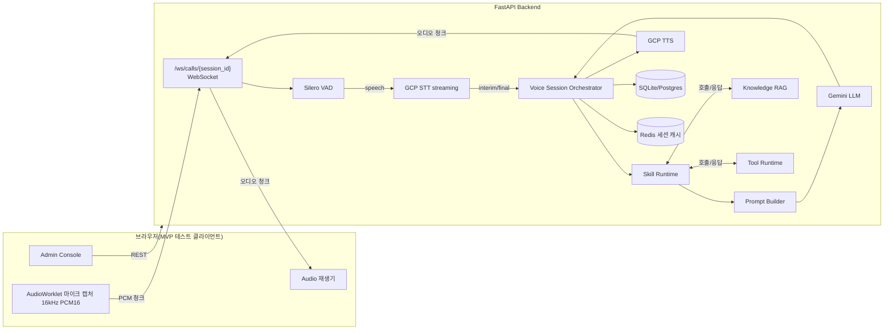
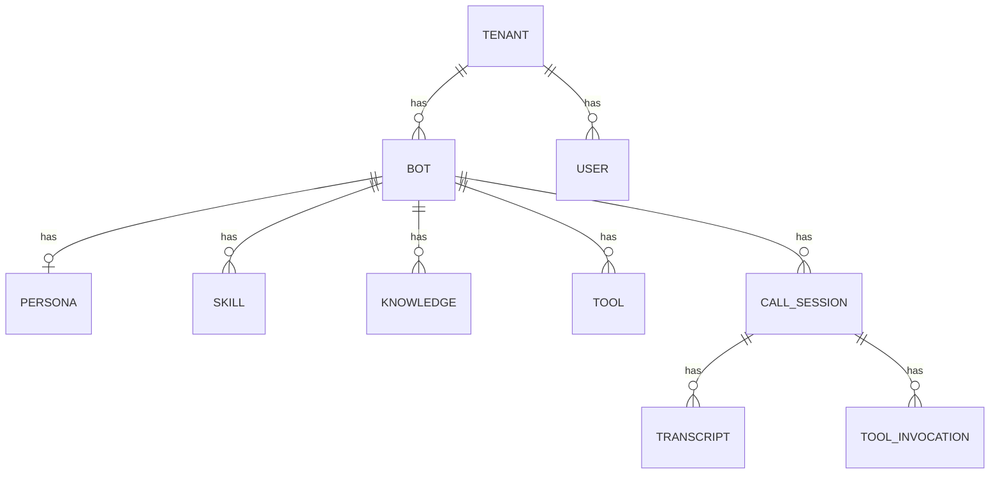
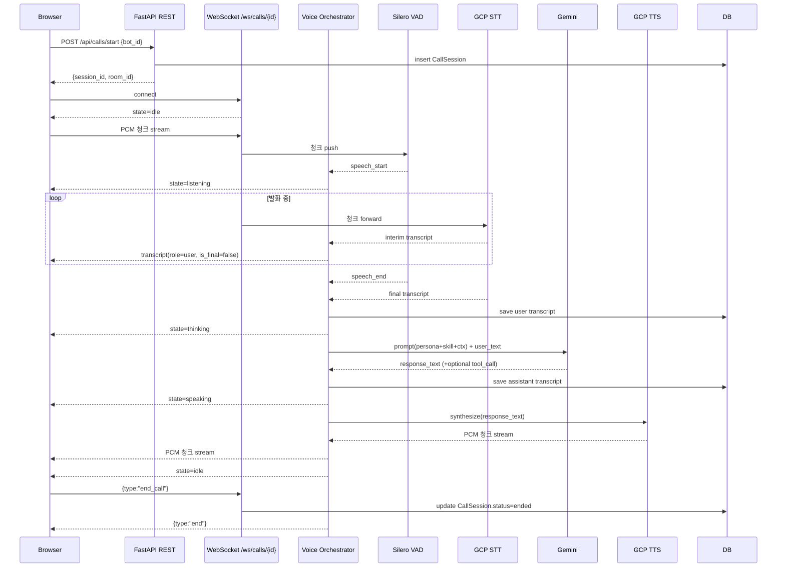

# vox 내재화 설계안 — B2B 콜봇 자체 구축

> 목표: 현재 vox를 매니지드로 사용하는 콜봇 기능을 우리 백엔드/프론트엔드 안으로 내재화한다.
> LiveKit은 필수 인프라가 아니라 Phase 2 이상에서 선택 가능한 media plane 옵션이다.

작성: 2026-05-11

---

## 0. Executive Summary

| 영역 | 결정 |
|---|---|
| 자체 구축 범위 | 음성 인식·합성·에이전트 두뇌·통화 세션·빌더 UI·관리·트랜스크립트 전부 |
| MVP media plane | **WebSocket 스트리밍 + Silero VAD** (브라우저 1:1 테스트). LiveKit/SIP 미사용 |
| STT/TTS/LLM | **GCP** (Speech-to-Text streaming, Cloud TTS, Gemini) |
| Backend | FastAPI + SQLAlchemy + SQLite(MVP) → PostgreSQL(운영). chatbot-v2 Clean Architecture 답습 |
| 재사용 자산 | 프롬프트 도메인, LLM/RAG 어댑터, 멀티테넌트 모델, Clean Architecture |
| 신규 개발 핵심 | 음성 파이프라인(AudioWorklet/WS/VAD/STT/TTS), 보이스 세션 오케스트레이터, 스킬 런타임, 콜봇 어드민 콘솔 |
| LiveKit 필요성 | **MVP 불필요**. Phase 2 풀듀플렉스/Phase 3 SIP 단계에서 후보 중 하나 |

핵심 통찰: **vox 내재화의 무거운 부분은 "음성 인프라"가 아니라 "콜봇 두뇌·스킬·관리 UI"이다.** 음성 미디어 운반은 WebSocket으로 시작해도 1:1 데모는 충분히 도는 반면, 두뇌·스킬 시스템은 처음부터 시간이 든다.

---

## 1. vox가 책임지는 콜봇 서버 기능 분해

`https://docs.tryvox.co/` 분석 결과, vox는 아래 영역을 매니지드로 제공한다.

| 영역 | vox가 하는 일 | 우리에게 필요한 것 |
|---|---|---|
| 음성 인식 (STT) | 발음 가이드, 키워드, 인터럽트 반응성 설정 | GCP Speech-to-Text 직접 호출 + 우리 발음 사전 |
| 음성 합성 (TTS) | 다국어 음성 모델, 발음 가이드, 끼어들기 동작 | GCP TTS 직접 호출 + 우리 음성 정책 |
| 에이전트 타입 | Prompt Agent / Flow Agent (노드 기반) | 우리 Skill 런타임(markdown content + 옵션 노드) |
| 페르소나 | 봇 정체성·말투 일관성 | Persona 엔티티 + 시스템 프롬프트 빌더 |
| 스킬 | 의도별 워크플로우, 라이프사이클, 종료 조건 | Skill 엔티티 + Frontdoor 라우팅 + 스킬 전환 LLM 호출 |
| 지식 (RAG) | 문서·웹페이지·텍스트 업로드, 비동기 chunking/embedding | Knowledge 엔티티 + chunker + embedding + vector DB |
| 도구 (내장) | End Call, DTMF, SMS, 에이전트 전환, 통화 전환 | Built-in tool 핸들러 (MVP: End Call·핸드오프만) |
| 도구 (API) | 입력 스키마 + REST 실행 + 인증 | Tool 엔티티 + dynamic invocation 런타임 |
| 통화 세션 | 생성·조회·상태 관리·필터·종료 사유 추적 | CallSession 엔티티 + WebSocket 라이프사이클 |
| 트랜스크립트 | 통화 후 분석, 정보 추출, CSV export | Transcript/Message 엔티티 + 추출 후처리 잡 |
| 빌더 UI | 에이전트/스킬/플로우 비주얼 편집, 테스트 콘솔, 버전 관리 | 어드민 콘솔(React/HTML) + 테스트 콜 UI |
| 동적 변수 | 웹훅·SDK·테스트 프리셋으로 주입, SIP 헤더에서 추출 | Variable 컨텍스트 + 프롬프트 슬롯 채움 |
| 웹훅 | 에이전트/조직 단위, HMAC 서명, 이벤트 페이로드 | Webhook 송신/수신 모듈 (chatbot-v2 재사용) |
| 분석/알림 | 차트, 지표 이상 감지, 인시던트 | Analytics 이벤트 + Grafana/임계값 알림 |
| 멀티테넌트 | 워크스페이스, 역할(오너/관리자/멤버), 격리 | Tenant/User/Role 모델 (chatbot-v2 재사용) |
| 텔레포니 | Vox 발급 번호 / SIP trunk, 인바운드·아웃바운드 매핑 | Phase 3: SIP 게이트웨이 (LiveKit SIP / Twilio) |
| 캠페인 | 대량 발신, 상태 추적, 단건 발신 API | Phase 3: 캠페인 잡 워커 |
| 미디어 운반 (WebRTC) | 명시는 없지만 내부적으로 처리됨 | WebSocket(MVP) / WebRTC(Phase 2+) |

---

## 2. chatbot-v2 재사용 가능 영역

`src/` 디렉터리 분석 결과, Clean Architecture 패턴이 잘 잡혀 있고 콜봇으로 옮길 가치 있는 자산이 많다.

### 그대로 재사용 가능

| 자산 | 위치 | 콜봇에서의 역할 |
|---|---|---|
| Clean Architecture 스캐폴딩 | `src/{api,application,domain,infrastructure,core}` | 동일 패턴으로 callbot-platform 백엔드 구성 |
| Tenant 도메인 서비스 | `src/domain/services/tenant_domain_service.py` | 콜봇 워크스페이스/조직 모델 직접 차용 |
| 프롬프트 도메인 | `src/domain/prompts/` (system, defaults, router, security_audit) | 콜봇 시스템 프롬프트·라우터 베이스로 사용 |
| LLM 어댑터 (Vertex AI / Gemini) | `src/infrastructure/llm/google/google_vertex_ai.py` | 콜봇 LLM 호출 그대로 |
| RAG 파이프라인 | `src/infrastructure/rag/custom/`, `external/gemini_file_search.py` | 콜봇 지식 검색 그대로 |
| Crypto, distributed lock, OCR 포트 | `src/domain/ports/` | 멀티 인스턴스 운영 시 동일 패턴 적용 |
| Webhook 송수신 | `src/domain/services/webhook_*`, `src/infrastructure/messaging` | 콜봇 이벤트 외부 전송에 그대로 |
| Redis 캐시 패턴 | `src/infrastructure/cache/` | 통화 세션 임시 상태/디바운스 |
| 보안 가이드 (가드레일) | `src/domain/prompts/system.py::get_guardrails` | 콜봇 시스템 프롬프트에 그대로 합성 |

### 일부 수정 후 재사용

| 자산 | 무엇을 바꿔야 하나 |
|---|---|
| 챗봇 세션 매니저 (`chat_domain_service.py`, `state_domain_service.py`) | turn-based → 음성 stream 기반. CallSession 모델 새로 작성하되 상태 흐름은 참고 |
| Agent Runtime (LangGraph) | 챗봇은 다중 노드 분기. 콜봇은 latency 우선 → Vox echo 같은 **단일 LLM call/turn + 스킬 스왑** 패턴으로 단순화 |
| Conversation State | 메시지 누적 방식은 유지. 단, partial transcript / interim 마킹 추가 |
| 응답 길이/형식 정책 | 챗봇 답변은 마크다운 자유. 콜봇은 음성 친화 정책(1~2문장, 발음 가이드) 강제 |
| 핸드오버 로직 (`handover_domain_service.py`) | 텍스트→상담사. 콜봇은 **통화 전환(call transfer)** 으로 변경 |

### 완전 신규 개발 필요

| 컴포넌트 | 이유 |
|---|---|
| Audio Pipeline (브라우저 → 서버) | 챗봇은 텍스트. 음성 캡처/스트리밍 모두 없음 |
| Silero VAD 어댑터 | 발화 경계 감지. 챗봇은 텍스트라 불필요 |
| GCP STT 스트리밍 어댑터 | 챗봇은 STT 없음 |
| GCP TTS 어댑터 | 챗봇은 TTS 없음 |
| Voice Session Orchestrator | duplex stream, interrupt, barge-in 처리 |
| Skill Loader / Runtime | content.md → 런타임 프롬프트 합성 + 스킬 전환 |
| Frontdoor 라우팅 | 진입 스킬에서 의도 파악 → 도메인 스킬 전환 |
| 콜봇 어드민 콘솔 | 봇/스킬/지식/도구/테스트 콜 UI 일체 |
| Tool 런타임 (API 도구) | 입력 스키마 + dynamic invocation. 챗봇의 plugin과 다른 패턴 |
| 콜 트랜스크립트 저장/조회 | 챗봇 Message와 별도 entity. 음성 timestamp 포함 |
| 통화 후 분석(요약/추출) | LLM 기반 후처리 잡 |
| 음성 친화 응답 후처리 | URL→문자, 숫자 발음, 마크다운 제거 |
| (Phase 2) WebRTC/LiveKit 통합 | full-duplex, barge-in 정밀도, 스케일아웃 |
| (Phase 3) SIP/PSTN 게이트웨이 | 실제 전화 수신/발신 |

---

## 3. 자체 구축 음성 콜봇 서버 컴포넌트 도식



### MVP 컴포넌트 책임

| 컴포넌트 | 책임 |
|---|---|
| AudioWorklet (브라우저) | 16kHz mono PCM16 캡처, 20ms 청크 단위 WebSocket 전송. 서버 메시지 수신 시 오디오 재생 |
| WebSocket 라우터 `/ws/calls/{session_id}` | 바이너리 PCM 수신, JSON 컨트롤 메시지 송수신, 오디오 청크 송신 |
| Silero VAD | 청크 단위로 speech start/end 감지. 침묵 300ms로 발화 종료 판정 |
| GCP STT streaming | speech start → end 사이 청크를 streaming_recognize에 흘림. interim/final transcript 발행 |
| Voice Session Orchestrator | session 상태 머신(idle/listening/thinking/speaking), barge-in 시 TTS 중단, DB/Redis 동기화 |
| Skill Runtime | Bot 설정 + 활성 Skill content.md + 페르소나 + 컨텍스트 변수 → LLM 프롬프트 빌드. LLM 결과의 `next_skill` 신호로 스킬 전환 |
| Prompt Builder | 가드레일 + 페르소나 + 활성 스킬 + RAG 컨텍스트 + 도구 디스크립션 + 음성 친화 정책 |
| Gemini LLM | system_instruction = built prompt, user_text = STT final, response = 자연어 + (옵션) 도구 호출 JSON |
| RAG | Bot의 Knowledge 검색 (MVP는 BM25/단순 임베딩, Phase 2 pgvector) |
| Tool Runtime | LLM이 도구 호출 시 REST 실행 (built-in: end_call, handover_to_human) |
| GCP TTS | LLM 응답 텍스트 → LINEAR16 16kHz 청크. 청크 단위 WebSocket 송신 |

---

## 4. media plane 선택지 — LiveKit 필요성 분석

| 옵션 | 장점 | 단점 | MVP 추천 |
|---|---|---|---|
| (A) WebSocket + AudioWorklet + Silero VAD | 의존성 최소. 브라우저 1:1 테스트 즉시 가능. 디버깅 쉬움 | 다자 통화/SIP 직결 불가. barge-in 정밀도 제한 | ✅ MVP |
| (B) LiveKit OSS 자체 호스팅 + Agents 프레임워크 | full-duplex, VAD/turn-taking primitives 무료. SIP 브릿지 경로 확보 | 인프라(Server + Redis) 운영. 학습 곡선 | Phase 2 후보 1 |
| (C) aiortc 등 순수 WebRTC | 완전 통제. 외부 종속 0 | signalling/SFU/scale 모두 직접 구현 | Phase 2 후보 2 |
| (D) Twilio Voice / Media Streams | SIP/PSTN 즉시 가능 | 벤더 락인 재발 (vox→twilio) | Phase 3에서 PSTN만 한정해 사용 가능 |

**결론: LiveKit은 vox 내재화의 필수 조건이 아니다.** 우리가 진짜 만들어야 하는 건 "두뇌"이고, media plane은 단계별로 선택지를 골라가면 된다.

---

## 5. MVP 범위 (테스트 가능한 1:1 콜봇)

목표: **한 명의 사용자가 브라우저에서 봇 설정 → 테스트 콜 → 음성으로 대화 → 로그/트랜스크립트 확인**까지 가능

### Backend
- FastAPI + SQLAlchemy + SQLite (env로 Postgres 전환 가능)
- Clean Architecture: `src/api/`, `src/application/`, `src/domain/`, `src/infrastructure/`, `src/core/`
- 엔티티: Tenant, Bot, Persona, Skill, Knowledge, Tool, CallSession, Transcript
- REST: Tenant/Bot/Skill/Knowledge/Tool/Call/Transcript CRUD
- WebSocket: `/ws/calls/{session_id}` PCM 양방향
- 어댑터: GCP STT, GCP TTS, Gemini LLM, Silero VAD (env로 Mock 전환 가능)
- 시드 데이터: 데모 테넌트 1 + 봇 1 + 스킬 3(Frontdoor/FAQ/Handover) + 지식 2

### Frontend (백엔드가 정적 서빙)
- 5개 화면: 대시보드 / 봇 / 봇 편집 / 테스트 콜 / 통화 로그
- 봇 편집: 페르소나, 시스템 프롬프트, 인사말, 스킬 markdown CRUD, 지식 CRUD
- 테스트 콜: 마이크 시작/중지, 라이브 트랜스크립트, 오디오 재생, 콜 종료
- 통화 로그: 세션 리스트 → 트랜스크립트 상세

### 제외 (Phase 2+)
- 다자 통화/SIP/PSTN
- 풀듀플렉스 barge-in 정밀 처리(MVP는 발화 끝 감지 후 응답)
- 캠페인 발신
- pgvector RAG (MVP는 단순 BM25/문자열 매칭)
- 정교한 도구 디스커버리 (MVP는 도구 등록만 + built-in handover)
- 빌링/요금제

---

## 6. 데이터 모델



| 엔티티 | MVP 필드 |
|---|---|
| Tenant | id, name, slug, created_at |
| User | id, tenant_id, email, role(owner/admin/member) — *MVP는 1 user 가정* |
| Bot | id, tenant_id, name, greeting, language, voice_name, llm_model, is_active |
| Persona | id, bot_id, content(text) |
| Skill | id, bot_id, name, description, content(markdown), is_frontdoor, order |
| Knowledge | id, bot_id, title, content(text) |
| Tool | id, bot_id, name, type(builtin/api), config(json) — *MVP: builtin handover만* |
| CallSession | id, bot_id, room_id(uuid), status(pending/active/ended), started_at, ended_at, end_reason |
| Transcript | id, session_id, role(user/assistant/system), text, is_final, started_at, ended_at |
| ToolInvocation | id, session_id, tool_id, args(json), result(json), created_at |

---

## 7. API 설계

### REST

```
GET  /api/tenants                        고객사 목록
POST /api/tenants                        생성
GET  /api/bots?tenant_id=                봇 목록
POST /api/bots                           봇 생성
GET  /api/bots/{id}                      봇 단건
GET  /api/bots/{id}/runtime              런타임 합성 프롬프트 (디버깅용)
PATCH /api/bots/{id}                     수정
DELETE /api/bots/{id}                    삭제
GET  /api/skills?bot_id=                 스킬 목록
POST /api/skills                         생성
PATCH /api/skills/{id}                   수정
DELETE /api/skills/{id}
GET  /api/knowledge?bot_id=              지식 목록
POST /api/knowledge                      생성
DELETE /api/knowledge/{id}
POST /api/calls/start                    세션 생성 → room_id 반환
POST /api/calls/{id}/end                 세션 종료
GET  /api/calls?bot_id=                  통화 목록
GET  /api/transcripts/{session_id}       트랜스크립트 조회
```

### WebSocket

```
/ws/calls/{session_id}

[client → server]
  bytes : LINEAR16 16kHz mono PCM 청크
  text  : {"type":"end_call"} | {"type":"interrupt"}

[server → client]
  bytes : LINEAR16 16kHz mono PCM 청크 (TTS)
  text  : {"type":"transcript","role":"user","text":"...","is_final":false}
        | {"type":"transcript","role":"assistant","text":"..."}
        | {"type":"state","value":"listening|thinking|speaking|idle"}
        | {"type":"end","reason":"..."}
```

---

## 8. 한 통화의 시퀀스



---

## 9. Phase 로드맵

| Phase | 목표 | media plane | 추가 항목 |
|---|---|---|---|
| MVP (지금) | 1:1 브라우저 테스트 콜 | WebSocket + Silero VAD | Bot CRUD, 스킬 markdown, 지식 텍스트, 트랜스크립트 |
| Phase 2 | 풀듀플렉스/barge-in 정밀화 + 운영 기반 | (A) WebSocket 확장 + 인터럽트 강화, **또는** (B) LiveKit OSS 자체 호스팅으로 이전 | pgvector RAG, 도구 API 호출 본격화, 통화 후 분석/요약, 사용자/권한 |
| Phase 3 | 실제 전화 연동 | LiveKit SIP / Twilio SIP 트렁크 | 캠페인 발신, DTMF, 통화 전환, 녹취, SLA 모니터링, 빌링 |

---

## 10. 기술 리스크

| 리스크 | 영향 | 완화 |
|---|---|---|
| GCP STT 스트리밍 latency 변동 | 응답 1~2초 SLA 위반 | interim 보여서 체감 latency 감소, 한국 리전 사용 |
| WebSocket 청크 손실/지연 | 음성 끊김 | 청크 크기 20ms, 클라이언트 버퍼 100ms |
| barge-in 정밀도 (MVP는 약함) | 봇이 말 중 사용자가 끼어들면 부자연스러움 | MVP는 사용자 발화 시작 시 TTS 즉시 중단(거친 컷). Phase 2에서 정밀화 |
| 스킬 전환 LLM 비용 | 비용 증가 | 단일 LLM call/turn 패턴 고수. 라우팅 별도 호출 X |
| pgvector 도입 전 RAG 품질 | 답변 부정확 | MVP는 지식 1~2개 + 시스템 프롬프트에 인라인 삽입. Phase 2에서 정식 RAG |

---

## 11. 디렉터리 설계 (callbot-platform/backend)

```
callbot-platform/backend/
├── pyproject.toml
├── .env.example
├── README.md
├── main.py
└── src/
    ├── app.py                       # create_app
    ├── core/
    │   ├── config.py                # pydantic-settings
    │   └── logging.py
    ├── domain/
    │   ├── entities.py              # 도메인 엔티티 (순수)
    │   ├── ports.py                 # STT/TTS/LLM/VAD 인터페이스
    │   └── prompts.py               # 시스템 가드레일 + 음성 정책
    ├── application/
    │   ├── voice_session.py         # Voice Session Orchestrator
    │   ├── skill_runtime.py         # Skill 로더 + 프롬프트 빌더
    │   └── tool_runtime.py          # built-in + API 도구 실행
    ├── infrastructure/
    │   ├── db.py                    # SQLAlchemy engine/session
    │   ├── models.py                # ORM
    │   ├── repositories.py
    │   ├── seed.py
    │   └── adapters/
    │       ├── google_stt.py
    │       ├── google_tts.py
    │       ├── gemini_llm.py
    │       └── silero_vad.py
    └── api/
        ├── schemas.py
        ├── routers/
        │   ├── tenants.py
        │   ├── bots.py
        │   ├── skills.py
        │   ├── knowledge.py
        │   ├── tools.py
        │   ├── calls.py
        │   └── transcripts.py
        ├── ws/
        │   └── voice.py             # WebSocket /ws/calls/{id}
        └── static/
            ├── index.html
            ├── styles.css
            ├── app.js
            └── audio-worklet.js
```

---

## 12. 즉시 착수 항목 (MVP 빌드)

1. `backend/` 디렉터리 + pyproject + .env.example
2. SQLAlchemy 모델 + 마이그레이션 없이 `Base.metadata.create_all`로 시작
3. REST 라우터 7종
4. WebSocket `/ws/calls/{id}` + 어댑터 4종 (STT/TTS/LLM/VAD)
5. Silero VAD 통합 (silero-vad pip)
6. Voice Session Orchestrator 상태 머신
7. 어드민 콘솔 정적 서빙 (HTML/CSS/JS + AudioWorklet)
8. 시드 데이터 (마이리얼트립 데모 봇)
9. README + run.sh + .env.example
10. Mock 어댑터 (env에 GCP 키 없으면 텍스트 echo로 동작) — 데모용
